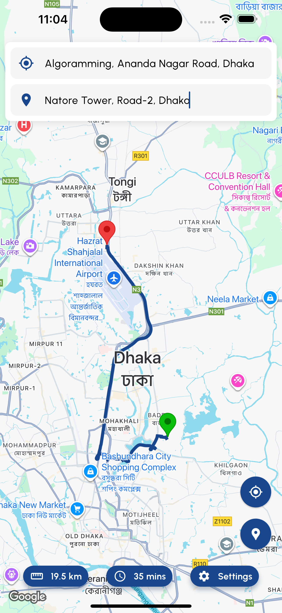
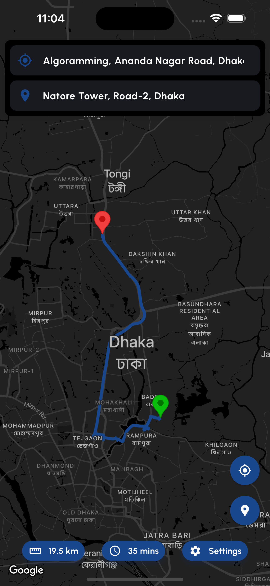

# 🗺️ Google Maps Route Playground

A beautiful Flutter application that demonstrates Google Maps integration with real-time route planning, location search, and navigation features. Built with modern Flutter architecture using Riverpod for state management and featuring both light and dark themes.

## ✨ Features

- **🔍 Smart Location Search**: Google Places autocomplete with real-time suggestions
- **🛣️ Optimized Route Planning**: Real-time route calculation using Google Directions API
- **📏 Route Information**: Display distance and estimated travel time
- **🎨 Theme Support**: Beautiful light and dark mode themes
- **📍 Interactive Markers**: Source and destination markers with custom icons
- **🎯 Navigation Controls**: Quick navigation to source/destination locations
- **📱 Responsive Design**: Optimized for all screen sizes
- **🚀 Modern Architecture**: Built with Riverpod, Go Router, and clean architecture

## 📸 Screenshots

### Light Mode


### Dark Mode


## 🚀 Getting Started

### Prerequisites

- Flutter SDK (>=3.9.0)
- Dart SDK
- Google Maps API Key
- Android Studio / VS Code
- iOS development setup (for iOS deployment)

### API Setup

1. **Get Google Maps API Key**:
   - Go to [Google Cloud Console](https://console.cloud.google.com/)
   - Enable the following APIs:
     - Maps SDK for Android
     - Maps SDK for iOS
     - Places API
     - Directions API
     - Geocoding API

2. **Configure API Key**:
   - Create a `.env` file in the root directory (copy from `dotenv` file)
   - Add your API key: `GOOGLE_MAP_KEY=your_api_key_here`

### Installation

1. **Clone the repository**:
   ```bash
   git clone https://github.com/yourusername/google_map_route_playground.git
   cd google_map_route_playground
   ```

2. **Install dependencies**:
   ```bash
   flutter pub get
   ```

3. **Generate app icons**:
   ```bash
   dart run flutter_launcher_icons:main
   ```

4. **Generate native splash screens**:
   ```bash
   dart run flutter_native_splash:create
   ```

5. **Generate Hive adapters**:
   ```bash
   dart run build_runner build
   ```

6. **Run the app**:
   ```bash
   flutter run
   ```

## 📦 Download APK

📱 **[Download Latest APK](dist/app-release.apk)** - Ready to install on Android devices

*Note: The APK file will be available in the `dist/` folder once built.*

## 🏗️ Project Structure

```
lib/
├── main.dart
├── src/
│   ├── app.dart
│   ├── core/
│   │   ├── config/          # App configuration
│   │   ├── router/          # Navigation routing
│   │   ├── utils/           # Utility functions
│   │   └── shared/          # Shared widgets
│   ├── features/
│   │   ├── home/
│   │   │   ├── provider/    # Map state management
│   │   │   └── view/        # UI components
│   │   └── settings/        # App settings
│   └── injector.dart        # Dependency injection
```

## 🛠️ Built With

- **[Flutter](https://flutter.dev/)** - UI toolkit
- **[Riverpod](https://riverpod.dev/)** - State management
- **[Google Maps Flutter](https://pub.dev/packages/google_maps_flutter)** - Maps integration
- **[Go Router](https://pub.dev/packages/go_router)** - Navigation
- **[Hive](https://pub.dev/packages/hive_ce)** - Local storage
- **[HTTP](https://pub.dev/packages/http)** - API calls
- **[Geolocator](https://pub.dev/packages/geolocator)** - Location services

## 🎨 Key Features Breakdown

### Map Integration
- Interactive Google Maps with custom styling
- Real-time polyline rendering for routes
- Custom markers for source and destination
- Camera controls and bounds fitting

### Route Planning
- Google Directions API integration
- Polyline decoding for accurate route display
- Distance and duration calculation
- Error handling with fallback to straight lines

### User Interface
- Material Design 3 components
- Responsive layout with Stack positioning
- Smooth animations and transitions
- Theme-aware color schemes

### State Management
- Reactive programming with Riverpod
- Clean separation of concerns
- Type-safe state updates
- Efficient rebuilds

## 🤝 Contributing

Contributions are welcome! Please feel free to submit a Pull Request.

1. Fork the project
2. Create your feature branch (`git checkout -b feature/AmazingFeature`)
3. Commit your changes (`git commit -m 'Add some AmazingFeature'`)
4. Push to the branch (`git push origin feature/AmazingFeature`)
5. Open a Pull Request

## 📝 License

This project is licensed under the MIT License - see the [LICENSE](LICENSE) file for details.

## 👨‍💻 Author

**Sabik Rahat**
- GitHub: [@sabikrahat](https://github.com/sabikrahat)
- Email: sabikrahat72@gmail.com

## ⭐ Show Your Support

Give a ⭐️ if this project helped you!

---

**Made with ❤️ using Flutter**